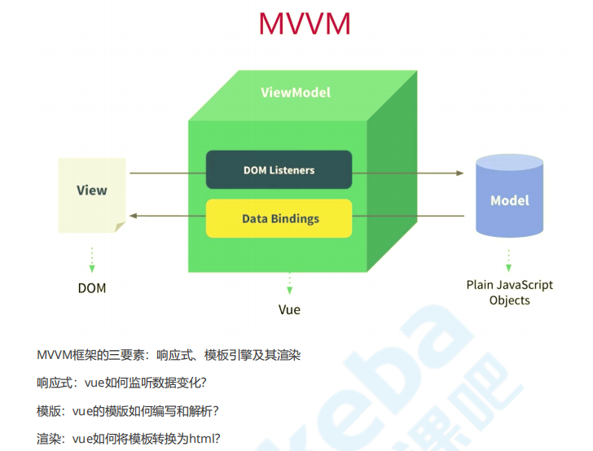

# vue 学习 # 

## 预习视频 ##

### 1 npm i -g http-server 安装静态服务器 ###

### 2 `Vue` 的设计思想：###
  * 数据驱动应用
  * MVVM模式的践行者
### 3 `MVVM` 框架的三要素：响应式、模板引擎及其渲染 ###


  * 响应式：`vue` 如何监听数据变化？
  * 模板：`vue` 的模板如何编写和解析？
  * 渲染：`vue` 如何将模板转换为 `html`?

### 4  `<h2 :title="title">title</h>` 这样当鼠标放上去，就会有`title`提示信息 ###

### 5 计算属性 VS 监听器 ###
* 处理数据的场景不同，监听器适合 **一个数据影响多个数据**，计算属性适合 **一个数据受多个数据影响**
* **计算属性有缓存性**，计算所得的值如果没有变化不会重复执行，不会浪费资源
* 监听器选项提供了更通用的方法，适合 **执行异步操作或较大开销操作** 的情况

### 6 生命周期 ###
#### 三个阶段：初始化、更新、销毁 ####
* 初始化：`beforeCreate` `created` `beforeMount` `mounted`
* 更新：`beforeUpdate` `updated`
* 销毁：`beforeDestory` `destroyed`

* `beforeCreated`：执行时组件实例还未创建，通常用于插件开发中执行一些初始化任务
* `created`：组件初始化完毕，各种数据可以使用，常用于异步数据获取，组件实例已经创建，由于未挂载，`dom` 不存在
* `beforeMounted`：未执行渲染、更新，`dom` 未创建
* `mounted`：挂载：将前面的渲染函数执行后得到的虚拟 `dom` 转换为真实 `dom`;初始化结束，`dom` 已创建，可用于获取访问数据和`dom`元素
* `beforeUpdate`：更新前，可用于获取更新前各种状态
* `updated`：更新后，所有状态已是最新
* `beforeDestroy`：销毁前，可用于一些定时器或订阅的取消
* `destroyed`：组件已销毁，作用同上

### 7 自定义组件实现双向绑定 ###
* 组件定义中最好让他无状态，这样更加内聚，更加方便复用

### 8 `Vue` 组件化的理解 ###
* **定义：**组件是**可复用的 `Vue` 实例**，准确讲它们是VueComponent的实例，继承自Vue。
* **优点：** 组件化可以增加代码的 **复用性**、**可维护性**和**可测试性**。
* **使用场景：**
    * 通用组件
    * 业务组件
    * 页面组件
* **如何使用组件：**
  * 定义：`Vue.component()`、`components` 选项、`sfc`
  * 分类：有状态组件、`functional`、`abstract`
  > `functionsl：`组件 **没有管理任何状态**，也 **没有监听任何传递给他的状态(watch)**，也 **没有生命周期方法** 时，可以将组件标记为 `functional`，这意味他无状态(没有响应式数据)，也没有实例(没有`this`上下文)
  * 通信：`props`、`$emit()/$on()`、`provide/inject`、`$children/$parent/$root/$attrs/$listeners`、事件总线(不受组件间关系的影响)：`Vue.prototype.$bus = new Vue()`
  * 内容分发：`<slot>`、 `<template>`、 `v-slot`
  * 使用及优化：`is`、 `keep-alive`、 异步组件
* **组件的本质 `vue` 中的组件经历如下过程：**

  >组件配置 => `VueComponent`实例 => `render()` =>  `Virtual DOM` => `DOM`

  所以 **组件的本质是产生虚拟 `DOM`**

### 9 `vue` 必会 `API` 盘点 ###
#### 数据相关 `API` ###
`Vue.set`、 `Vue.delete`、 `this.$set`、 `this.$delete`
>`Vue.set(target, propertyName/index, value)`
>`Vue.delete(target, propertyName/index)`
#### 事件相关 `API` ####
`vm.$on`、 `vm.$emit`

 >典型应用：事件总线  
 >`Vue.prototype.$bus = new Vue()`  
 >通过在Vue原型上添加一个Vue实例作为事件总线，实现组件间相互通信，而且不受组件间关系的影响

 `vm.$onse`、 `vm.$off`
 >`vm.$off()：`移除所有的事件监听器  
 >`vm.$off('name')：`移除该事件所有的监听器
 >`vm.$off('name', callback)：`只移除这个回调的监听器
#### 组件或元素引用 ####
`ref`、 `vm.$refs`
>* `ref` 是作为渲染结果被创建，在初始渲染时不能访问它们
>* `$refs` 不是响应式的，不要试图用它在模板中做数据绑定?
>* 当 `v-for` 用于元素或组件时，引用信息将是包含 `DOM` 节点或组件实例的数组


### 10 可复用性 ###
* 过滤器
* 自定义指令
  >使用场景：当需要对普通 `DOM` 元素进行底层操作
* 渲染函数
* 函数式组件
* 混入
* 插件

### 11 自动导入样式 ###

>`npm i -D style-resources-loader`  
```js
// vue.config.js
function addStyleResource(rule) {
  rule.use('style-resource')
    .loader('style-resources-loader')
    .options({
    patterns: [
      path.resolve(__dirname, './src/styles/imports.scss'),
    ],
  })
}

module.exports = {
  chainWebpack: config => {
    const types = ['vue-modules', 'vue', 'normal-modules', 'normal']
    types.forEach(type =>
      addStyleResource(config.module.rule('scss').oneOf(type)))
  }
}

```

### 12 响应路由参数变化 ###
```js
export default {
  watch: {
    $route: {
      immediate: true, // 立即响应
      handler: () => {}
    }
  }
}
```

### 13 路由守卫 ###
```js
router.beforeEach((to, from, next) => {
  if (isLogin) {
    next()
  } else {
    next('/login?redirect=' + to.fullPath) // 将当前想进入页面的地址用`query`传参到login页面
  }
})
```
### 14 路由数据获取时机 ###
* 路由导航前  
```js
// 组件未渲染，通过给next传递回调访问组件实例
beforeRouteEnter (to, from, next) {
  fetchData(to.params.id, res => {
    next(vm => vm.setData(res))
  })
}
// 组件已经渲染，可以访问this直接赋值
beforeRouteUpdate (to, from, next) {
  this.post = null
  fetchData(to.params.id, post => {
    this.setData(post)
    next()
  })
}
```
* 路由导航后
```js
created() {
  this.fetchData()
},
watch: {
  '$route': 'fetchData'
}
```

### 15 动态添加路由 ###
`this.$router.addRoutes(routes)`

<hr>

## 一、 `vue`组件化实践 ##
1. 事件的派发(`vm.$emit`)和监听(`vm.$on`)都在同一个组件上
2. `this.$children`数组中的元素是当前组件下的 **自定义组件**
